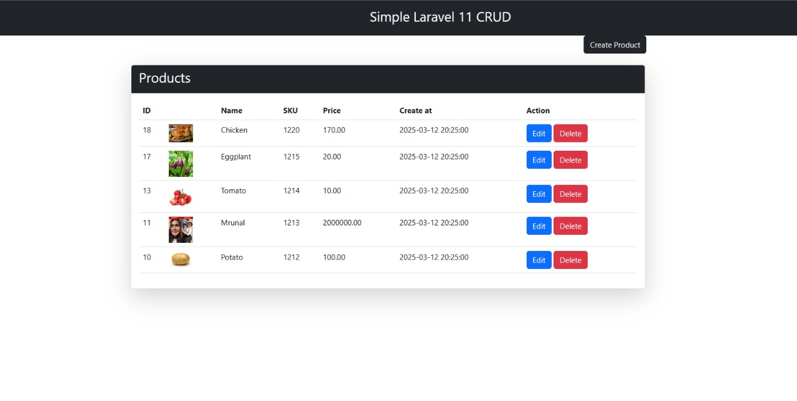

# Project Screenshots

This document contains screenshots demonstrating the **Create**, **Read**, **Update**, and **Delete** actions in the project.

---

### 1. **Create** Action

The **Create** action allows the user to add a new item to the system.

---

### 2. **Read** Action

The **Read** action displays the list of items, allowing the user to view details.

---

### 3. **Update** Action

The **Update** action allows users to edit an existing item.

---

### 4. **Delete** Action

The **Delete** action enables users to remove an item from the system.

---

### Summary

These actions represent the core functionality of the application, allowing users to manage the data effectively.
